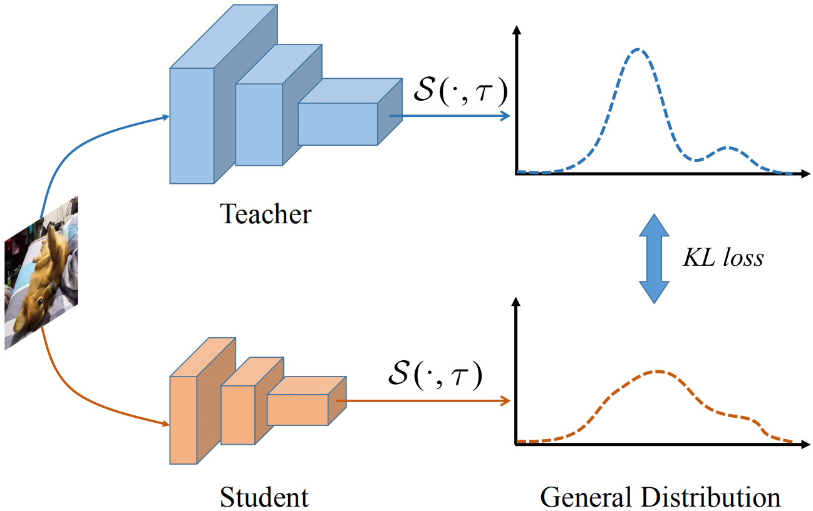

# Localization Distillation for Object Detection 

### This repo is based on MMDetection.

This is the code for our paper:
 - [Localization Distillation for Object Detection](https://arxiv.org/abs/1911.08287)

LD is the extension of knowledge distillation on localization task, which utilizes the learned bbox distributions to transfer the localization dark knowledge from teacher to student.

LD stably improves over GFocalV1 about ~0.8 AP and ~1 AR100 without adding any computational cost! 

## Introduction

Knowledge distillation (KD) has witnessed its powerful ability in learning compact and efficient models in several deep learning fields, but it is still limited in distilling localization information for object detection. Existing KD methods for object detection mainly focus on mimicking deep features between teacher model and student model, which not only is restricted by specific model architectures, but also cannot distill localization ambiguity. KD for object detection two issues: (i) how to distill localization information for arbitrary detector architecture, (ii) how to choose effective teacher model for distillation. In this paper, we first propose localization distillation (LD) for object detection. In particular, our LD can be formulated as standard KD by adopting the general localization representation of bounding box. Our LD is very simple and flexible, and is applicable to distill localization ambiguity for arbitrary architecture of teacher model and student model. Moreover, it is interesting to find that Self-LD, i.e., distilling teacher model itself, can further boost state-of-the-art performance. Second, we suggest a teacher assistant (TA) strategy to fill the possible gap between teacher model and student model, by which the distillation effectiveness can be guaranteed even the selected teacher model is not optimal. On benchmark datasets PASCAL VOC and MS COCO, our LD can consistently improve the performance for student models, and also boosts state-of-the-art detectors notably.




## Installation

Please refer to [INSTALL.md](docs/INSTALL.md) for installation and dataset preparation.

## Get Started

Please see [GETTING_STARTED.md](docs/GETTING_STARTED.md) for the basic usage of MMDetection.

## Train

```python
# assume that you are under the root directory of this project,
# and you have activated your virtual environment if needed.
# and with COCO dataset in 'data/coco/'

./tools/dist_train.sh configs/ld/ld_gflv1_r101_r50_fpn_coco_1x.py 8
```

#### Learning rate setting

`lr=(samples_per_gpu * num_gpu) / 16 * 0.01`

For 2 GPUs and mini-batch size 6, the relevant portion of the config file would be:

```python
optimizer = dict(type='SGD', lr=0.00375, momentum=0.9, weight_decay=0.0001)
data = dict(
    samples_per_gpu=3,
```

For 8 GPUs and mini-batch size 16, the relevant portion of the config file would be:

```python
optimizer = dict(type='SGD', lr=0.01, momentum=0.9, weight_decay=0.0001)
data = dict(
    samples_per_gpu=2,
```

## Convert model

After training with LD, the weight file `.pth` will be large. You'd better convert the model to save a new small one. See [convert_model.py#L38-L40](convert_model.py#L38-L40), you can set them to your `.pth` file and config file. Then, run
```python
python convert_model.py
```

## Speed Test (FPS)

```python
CUDA_VISIBLE_DEVICES=0 python3 ./tools/benchmark.py configs/ld/ld_gflv1_r101_r50_fpn_coco_1x.py work_dirs/ld_gflv1_r101_r50_fpn_coco_1x/epoch_24.pth
```

## COCO Evaluation

```python
./tools/dist_test.sh configs/ld/ld_gflv1_r101_r50_fpn_coco_1x.py work_dirs/ld_gflv1_r101_r50_fpn_coco_1x/epoch_24.pth 8 --eval bbox
```
### GFocalV1 with LD
| Teacher | Student | Training schedule | Mini-batch size | AP (val)| AP50 (val) | AP75 (val) | AP (test-dev)| AP50 (test-dev) | AP75 (test-dev)| AR100 (test-dev)|
|:----:|:-------:|:-------:|:----:|:----:|:----:|:----:|:----:|:----:|:----:|:----:|
|   --  | R-18 | 1x | 6 |  35.8  |  53.1  |  38.2  |  36.0  |  53.4  |  38.7  |  55.3  |
| R-101 | R-18 | 1x | 6 |  36.5  |  52.9  |  39.3  |  36.8  |  53.5  |  39.9  |  56.6  |
|   --  | R-34 | 1x | 6 |  38.9  |  56.6  |  42.2  |  39.2  |  56.9  |  42.3  |  58.0  |
| R-101 | R-34 | 1x | 6 |  39.8  |  56.6  |  43.1  |  40.0  |  57.1  |  43.5  |  59.3  |
|   --  | R-50 | 1x | 6 |  40.1  |  58.2  |  43.1  |  40.5  |  58.8  |  43.9  |  59.0  |
| R-101 | R-50 | 1x | 6 |  41.1  |  58.7  |  44.9  |  41.2  |  58.8  |  44.7  |  59.8  |
|   --  | R-101 | 2x | 6 |  44.6  |  62.9  |  48.4  |  45.0  |  63.6  |  48.9  |  62.3  |
| R-101-DCN | R-101 | 2x | 6 |  45.4  |  63.1  |  49.5  |  45.6  |  63.7  |  49.8  |  63.3  |

### GFocalV1 with Self-LD

| Teacher | Student | Training schedule | Mini-batch size | AP (val)| AP50 (val) | AP75 (val)|
|:----:|:-------:|:-------:|:----:|:----:|:----:|:----:|
|  --    | R-18 | 1x | 6 |  35.8  |  53.1  |  38.2  |
| R-18  | R-18 | 1x | 6 |  36.1  |  52.9  |  38.5  |
|  --    | R-50 | 1x | 6 |  40.1  |  58.2  |  43.1  |
| R-50  | R-50 | 1x | 6 |  40.6  |  58.2  |  43.8  |
|  --    | X-101-32x4d-DCN | 1x | 4 |  46.9  |  65.4  |  51.1  |
| X-101-32x4d-DCN | X-101-32x4d-DCN | 1x | 4 |  47.5 |  65.8  |  51.8  |

### GFocalV2 with LD

| Teacher | Student | Training schedule | Mini-batch size | AP (test-dev)| AP50 (test-dev) | AP75 (test-dev)| AR100 (test-dev)|
|:----:|:-------:|:-------:|:----:|:----:|:----:|:----:|:----:|
|  --    | R-50 | 2x | 16 |  44.4  |  62.3  |  48.5  |  62.4  |
| R-101 | R-50 | 2x | 16 |  44.8  |  62.4  |  49.0  |  63.1  |
|  --    | R-101 | 2x | 16 |  46.0  |  64.1  |  50.2  |  63.5  |
| R-101-DCN| R-101 | 2x | 16 |  46.8  |  64.5  |  51.1  |  64.3  |
|  --    | R-101-DCN | 2x | 16 |  48.2  |  66.6  |  52.6  |  64.4  |
| R2-101-DCN| R-101-DCN | 2x | 16 |  49.1  |  67.1  |  53.7  |  65.6  |
|  --    | X-101-32x4d-DCN | 2x | 16 |  49.0  |  67.6  |  53.4  |  64.7  |
| R2-101-DCN| X-101-32x4d-DCN | 2x | 16 |  50.2  |  68.3  |  54.9  |  66.3  |
|  --    | R2-101-DCN | 2x | 16 |  50.5  |  68.9  |  55.1  |  66.2  |
| R2-101-DCN| R2-101-DCN | 2x | 16 |  51.0  |  69.1  |  55.9  |  66.8  |

## VOC Evaluation

```python
./tools/dist_test.sh configs/ld/ld_gflv1_r101_r18_fpn_voc.py work_dirs/ld_gflv1_r101_r18_fpn_voc/epoch_4.pth 8 --eval mAP
```

### GFocalV1 with LD

| Teacher | Student | Training Epochs | Mini-batch size | AP | AP50 | AP75 |
|:----:|:-------:|:-------:|:----:|:----:|:----:|:----:|
|  --    | R-18 | 4 | 6 |  51.8  |  75.8  |  56.3  |
| R-101  | R-18 | 4 | 6 |  53.0  |  75.9  |  57.6  | 
|  --    | R-50 | 4 | 6 |  55.8  |  79.0  |  60.7  |
| R-101| R-50 | 4 | 6 |  56.1  |  78.5  |  61.2  |
|  --    | R-34 | 4 | 6 |  55.7  |  78.9  |  60.6  |
| R-101-DCN| R-34 | 4 | 6 |  56.7  |  78.4  |  62.1  |
|  --    | R-101 | 4 | 6 |  57.6  |  80.4  |  62.7  |
| R-101-DCN| R-101 | 4 | 6 |  58.4  |  80.2  |  63.7  |

[VOC teacher R101 pan.baidu](https://pan.baidu.com/s/16s-ae8GyWNZFPO_vyGqmUA) pw: ufc8
[VOC teacher R101DCN pan.baidu](https://pan.baidu.com/s/1PseEYuQG_WTCSuqoMSIcYQ) pw: 5qra
[VOC LD R101_R18 pan.baidu](https://pan.baidu.com/s/1Jd1UjfuxLi8MGD1JKruWxw) pw: 1bd3


This is an example of evaluation results (R-101→R-18).
```
+-------------+------+-------+--------+-------+
| class       | gts  | dets  | recall | ap    |
+-------------+------+-------+--------+-------+
| aeroplane   | 285  | 4154  | 0.081  | 0.030 |
| bicycle     | 337  | 7124  | 0.125  | 0.108 |
| bird        | 459  | 5326  | 0.096  | 0.018 |
| boat        | 263  | 8307  | 0.065  | 0.034 |
| bottle      | 469  | 10203 | 0.051  | 0.045 |
| bus         | 213  | 4098  | 0.315  | 0.247 |
| car         | 1201 | 16563 | 0.193  | 0.131 |
| cat         | 358  | 4878  | 0.254  | 0.128 |
| chair       | 756  | 32655 | 0.053  | 0.027 |
| cow         | 244  | 4576  | 0.131  | 0.109 |
| diningtable | 206  | 13542 | 0.150  | 0.117 |
| dog         | 489  | 6446  | 0.196  | 0.076 |
| horse       | 348  | 5855  | 0.144  | 0.036 |
| motorbike   | 325  | 6733  | 0.052  | 0.017 |
| person      | 4528 | 51959 | 0.099  | 0.037 |
| pottedplant | 480  | 12979 | 0.031  | 0.009 |
| sheep       | 242  | 4706  | 0.132  | 0.060 |
| sofa        | 239  | 9640  | 0.192  | 0.060 |
| train       | 282  | 4986  | 0.142  | 0.042 |
| tvmonitor   | 308  | 7922  | 0.078  | 0.045 |
+-------------+------+-------+--------+-------+
| mAP         |      |       |        | 0.069 |
+-------------+------+-------+--------+-------+
AP:  0.530091167986393
['AP50: 0.759393', 'AP55: 0.744544', 'AP60: 0.724239', 'AP65: 0.693551', 'AP70: 0.639848', 'AP75: 0.576284', 'AP80: 0.489098', 'AP85: 0.378586', 'AP90: 0.226534', 'AP95: 0.068834']
{'mAP': 0.7593928575515747}
```
#### Note:
 - For more experimental details, please refer to [GFocalV1](https://github.com/implus/GFocal), [GFocalV2](https://github.com/implus/GFocalV2) and [mmdetection](https://github.com/open-mmlab/mmdetection).
 - According to ATSS, there is no gap between box-based regression and point-based regression. **Personal conjectures**: 1) If xywh form is able to work when using general distribution (apply uniform subinterval division for xywh), our LD can also work in xywh form. 2) If xywh form with general distribution cannot obtain better result, then the best modification is to firstly switch xywh form to tblr form and then apply general distribution and LD. **Consequently**, whether xywh form + general distribution works or not, our LD benefits for all the regression-based detector.

## Score voting Cluster-DIoU-NMS
We provide Score voting Cluster-DIoU-NMS which is a speed up version of score voting NMS and combination with DIoU-NMS. For GFocalV1 and GFocalV2, Score voting Cluster-DIoU-NMS will bring 0.1-0.3 AP increase, 0.2-0.5 AP75 increase, <=0.4 AP50 decrease and <=1.5 FPS decrease, while it is much faster than score voting NMS in mmdetection. The relevant portion of the config file would be:

```
# Score voting Cluster-DIoU-NMS
test_cfg = dict(
nms=dict(type='voting_cluster_diounms', iou_threshold=0.6),

# Original NMS
test_cfg = dict(
nms=dict(type='nms', iou_threshold=0.6),
```

## Citation

If you find LD useful in your research, please consider citing:

```
@Article{zheng2021LD,
  title={Localization Distillation for Object Detection},
  author= {Zhaohui Zheng, Rongguang Ye, Ping Wang, Jun Wang, Dongwei Ren},
  journal={arXiv:2005.03572},
  year={2021}
}
```
